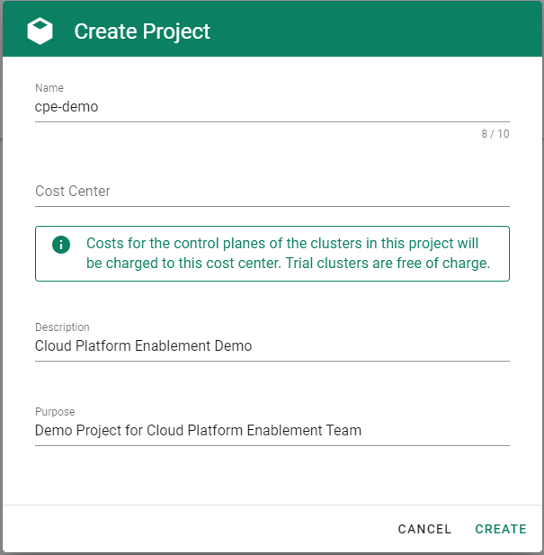

### Overview

Gardener allows you to create a Kubernetes cluster on different infrastructure providers. This tutorial will guide you through the process of creating a cluster on Alibaba Cloud.

### Prerequisites

- You have created an [Alibaba Cloud account](https://www.alibabacloud.com).
- You have access to the Gardener dashboard and have permissions to create projects.

### Steps

1. Go to the Gardener dashboard and create a project.

     

    > To be able to add shoot clusters to this project, you must first create a technical user on Alibaba Cloud with sufficient permissions.

1. Choose *Secrets*, then the plus icon  and select *AliCloud*.

    

1. To copy the policy for Alibaba Cloud from the Gardener dashboard, click on the help icon  for Alibaba Cloud secrets, and choose copy .

    

1. Create a custom policy in Alibaba Cloud:
     1. Log on to your Alibaba account and choose *RAM* \> *Permissions* \> *Policies*. 

          

     1. Enter the name of your policy.
     1. Select `Script`.
     1. Paste the policy that you copied from the Gardener dashboard to this custom policy.
     1. Choose *OK*.

          

1. In the Alibaba Cloud console, create a new technical user:
     1. Choose *RAM* \> *Users*.
     1. Choose *Create User*.

          

     1. Enter a logon and display name for your user.
     1. Select *Open API Access*.
     1. Choose *OK*.

          

     > After the user is created, `AccessKeyId` and `AccessKeySecret` are generated and displayed. Remember to save them. The `AccessKey` is used later to create secrets for Gardener.

     
      
1. Assign the policy you created to the technical user:
     1. Choose *RAM* \> *Permissions* \> *Grants*.
     1. Choose *Grant Permission*.

          

     1. Select *Alibaba Cloud Account*. 
     1. Assign the policy you’ve created before to the technical user.

          

1. Create your secret.

    1. Type the name of your secret.
    1. Copy and paste the `Access Key ID` and `Secret Access Key` you saved when you created the technical user on Alibaba Cloud.
    1. Choose *Add secret*.
    

    >After completing these steps, you should see your newly created secret in the *Infrastructure Secrets* section.

    

1. To create a new cluster, choose *Clusters* and then the plus sign in the upper right corner.

    

1. In the *Create Cluster* section:
    1. Select *AliCloud* in the *Infrastructure* tab.
    1. Type the name of your cluster in the *Cluster Details* tab.
    1. Choose the secret you created before in the *Infrastructure Details* tab.
    1. Choose *Create*.

          

1. Wait for your cluster to get created.
    
     

## Result

After completing the steps in this tutorial, you will be able to see and download the kubeconfig of your cluster. With it you can create shoot clusters on Alibaba Cloud.
     

> The size of persistent volumes in your shoot cluster must at least be 20 GiB large. If you choose smaller sizes in your Kubernetes PV definition, the allocation of cloud disk space on Alibaba Cloud fails.